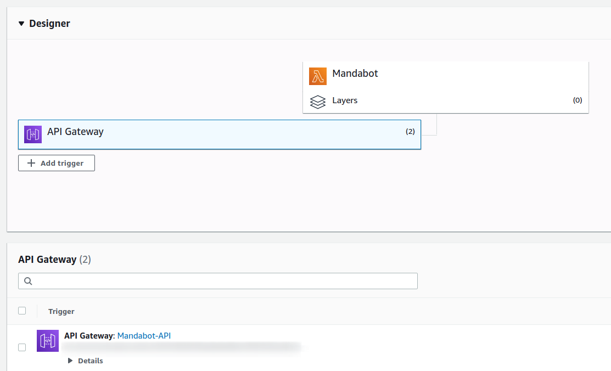
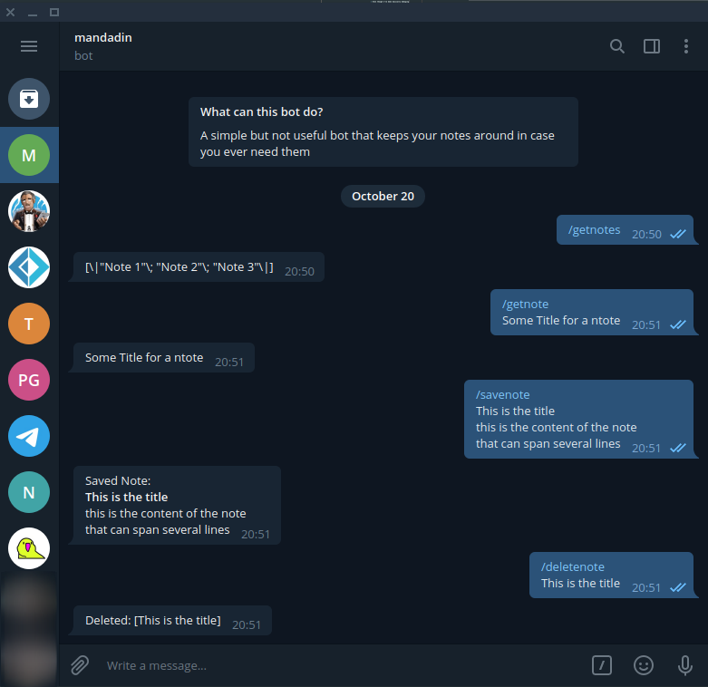

[lambda function]: https://docs.aws.amazon.com/lambda/latest/dg/welcome.html
[API Gateway]: https://docs.aws.amazon.com/lambda/latest/dg/services-apigateway.html
[Telegram Bot]: https://core.telegram.org/bots
[AWS CLI]: https://docs.aws.amazon.com/cli/latest/userguide/install-cliv2.html
[AWS .NET Tool Extensions]: https://github.com/aws/aws-lambda-dotnet
[AWS Lambda .NET Templates]: https://github.com/aws/aws-lambda-dotnet
[VSCode AWS Extension]: https://marketplace.visualstudio.com/items?itemName=AmazonWebServices.aws-toolkit-vscode

# F# + AWS Lambda

> ## Disclaimer
> I'm no serverless/lambda expert, I'm just a guy that found really easy to get started with AWS lambda using .NET specially F#

This is a simple F# [lambda function] that is used together with [API Gateway] and serves as the webhook for a [Telegram Bot]


I added the API Gateway manually inside the AWS Console, Lambdas can also be invoked for a number of events inside AWS services, API Gateway, like S3, DynamoDB, etc, etc

### Requirements
To create templates, deploy and work with .Net lambdas easily you need the following stuff

- [AWS CLI] - configure credentials for deployment via IAM (aws configure)
- [AWS Lambda .NET Templates] - dotnet CLI templates for Lambda (includes F# and Giraffe Serverless)
- [AWS .NET Tool Extensions] - Deployment tools for AWS Lambda
- [VSCode AWS Extension] - Easily access Logs and AWS Resources

you can also find the full suite of tools in the [aws dotnet](https://github.com/aws/dotnet) repository

Tests are simple to execute simply do

`dotnet test tests/Mandabot.Tests`

> Even though I've been basically debuging live hiting the endpoint and sending messages to the bot and letting telegram handle the update event
> 
> ## Also please be advised this bot+lambda is not connected to a database, the main purpose was to actually figure out the lambda development and deployment


## Deploying
Deploying is super simple, just update the `aws-lambda-tools-defaults.json` with your data (profile and region) then simply type
```sh
cd src/Mandabot
dotnet lambda deploy-function NAME_OF_YOUR_FUNCTION
```

the CLI will try to figure out if there's something missing with your configuration and prompt you if necessary if everything is fine it will deploy your Lambda Function in a few seconds and that's it your Lambda is live to start testing with it

## Invoking
Invoking your function is really easy as well

```
cd src/Mandabot
dotnet lambda invoke-function NAME_OF_YOUR_FUNCTION --payload "{ \"my-json\": \"object\" }"
```
